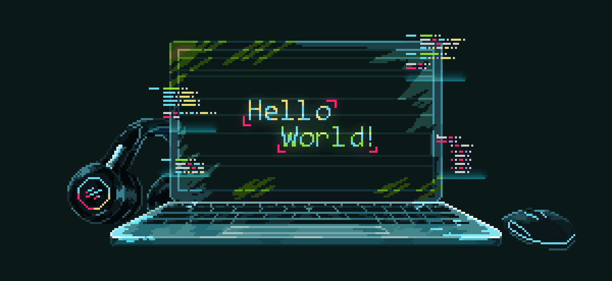

# 👋 Olá, me chamo João Guedes

---

## 🚀 Sobre Mim

Sou estudante de <strong>Tecnologia em Análise e Desenvolvimento de Sistemas</strong> e atualmente atuo como <strong>Analista de Dados</strong>.  
Tenho forte interesse em desenvolvimento <strong>Back End</strong>, automações e construção de sistemas escaláveis.

Busco constantemente evoluir tecnicamente, explorando novas arquiteturas, integrações e soluções que gerem impacto real.

💡 Apaixonado por tecnologia
👨‍💻 Desenvolvedor Full Stack em evolução
👨‍👩‍👧 Família como maior motivação
🚀 Focado em crescimento profissional contínuo

---

## ⚙️ Stack & Tecnologias

---

## 📊 Estatísticas GitHub

---

## 🏆 Highlights Profissionais

✅ Desenvolvimento de sistemas com Django
✅ Automação Desktop com Python
✅ Integrações REST API
✅ Geração dinâmica de PDFs
✅ Sistemas financeiros e administrativos
✅ Dashboards e análise de dados

---

## 🟢 Atualmente

* 🔭 Desenvolvendo sistemas web com Django e Next.js
* ⚡ Criando automações para ganho de produtividade
* 📚 Estudando arquitetura escalável e boas práticas backend
* 🚀 Evoluindo projetos SaaS próprios

---

## ⭐ Projetos em Destaque

<!-- AUTO-GENERATED:FEATURED_PROJECTS_START -->

<table width="100%">
<tr>
<td width="33%" valign="top">

### [guedes-jr](https://github.com/guedes-jr/guedes-jr)

MyPerfil

⭐ 0 • 🍴 0 • 🧠 N/A

</td>

<td width="33%" valign="top">

### [Angular-gerador-certificado](https://github.com/guedes-jr/Angular-gerador-certificado)

Sem descrição disponível

⭐ 0 • 🍴 0 • 🧠 CSS

</td>

<td width="33%" valign="top">

### [Django-Nexjs_ConectadoEmQuestoes](https://github.com/guedes-jr/Django-Nexjs_ConectadoEmQuestoes)

Projeto Django (backend) mais NexJS (frontend), visando desenvolvimento de sistema assinantes para estudantes de concursos.

⭐ 0 • 🍴 0 • 🧠 TypeScript

</td>
</tr><tr>
<td width="33%" valign="top">

### [Markdown](https://github.com/guedes-jr/Markdown)

Repositório de orientação a formatação de arquivos markdown

⭐ 3 • 🍴 1 • 🧠 CSS

</td>

<td width="33%" valign="top">

### [Dio-desafio_python](https://github.com/guedes-jr/Dio-desafio_python)

Material de Estudo e projetos realizados na Formação Python da DIO

⭐ 0 • 🍴 0 • 🧠 Python

</td>

<td width="33%" valign="top">

### [Vite-RoomVent](https://github.com/guedes-jr/Vite-RoomVent)

Projeto de remodelagem de design do site atual da empresa RoomVent

⭐ 0 • 🍴 0 • 🧠 TypeScript

</td>
</tr>
</table>

<!-- AUTO-GENERATED:FEATURED_PROJECTS_END -->

---

## 📂 Projetos por Tecnologia

<!-- AUTO-GENERATED:PROJECTS_START -->

## 🧠 C#

- **[.net-CRUD-AppWeb](https://github.com/guedes-jr/.net-CRUD-AppWeb)**
  - Sem descrição

## 🧠 CSS

- **[Markdown](https://github.com/guedes-jr/Markdown)**
  - Repositório de orientação a formatação de arquivos markdown

- **[.net-BlazingPizza](https://github.com/guedes-jr/.net-BlazingPizza)**
  - Projeto Front-End desenvolvido usando a a aplicação BlazorMvc do .Net

- **[Angular-gerador-certificado](https://github.com/guedes-jr/Angular-gerador-certificado)**
  - Sem descrição

- **[django-bootstrapp-corona](https://github.com/guedes-jr/django-bootstrapp-corona)**
  - Sem descrição

- **[django-my-finances](https://github.com/guedes-jr/django-my-finances)**
  - Sem descrição

- **[InDecor](https://github.com/guedes-jr/InDecor)**
  - Sem descrição

- **[NLW-Copa](https://github.com/guedes-jr/NLW-Copa)**
  - Calendário de Jogos da Copa

- **[Portfolio-Ninja](https://github.com/guedes-jr/Portfolio-Ninja)**
  - Modelo simples de portfólio para quem está iniciando no estudo de front end

## 🧠 Go

- **[Dio-desafio_go](https://github.com/guedes-jr/Dio-desafio_go)**
  - Desafio desenvolvido em go durante curso da Dio

- **[go-project_structure](https://github.com/guedes-jr/go-project_structure)**
  - Estrutura e organização basica para projetos em GO

## 🧠 HTML

- **[Educa.](https://github.com/guedes-jr/Educa.)**
  - Sem descrição

- **[ExplorerLab-RocketPay](https://github.com/guedes-jr/ExplorerLab-RocketPay)**
  - Sem descrição

- **[FitClub](https://github.com/guedes-jr/FitClub)**
  - Landing Page FitClub

- **[Front_End-Travel](https://github.com/guedes-jr/Front_End-Travel)**
  - Projeto front end de uma página de agência de viagens

- **[Ignite_Lab-notifications](https://github.com/guedes-jr/Ignite_Lab-notifications)**
  - Sem descrição

- **[LandingPageToms](https://github.com/guedes-jr/LandingPageToms)**
  - Landing Page Banda de Jazz

- **[Origin-BeautySalon](https://github.com/guedes-jr/Origin-BeautySalon)**
  - Landing Page Para são de produtos naturais

- **[Portfolio](https://github.com/guedes-jr/Portfolio)**
  - Meu Portfólio

- **[Social](https://github.com/guedes-jr/Social)**
  - Demo

- **[Template-Educacao](https://github.com/guedes-jr/Template-Educacao)**
  - Template Front-End de page relacionada a Educação

- **[TemplateLPModel](https://github.com/guedes-jr/TemplateLPModel)**
  - Template base para Landing page de apresentação de um App

- **[TemplateTravelAdventure](https://github.com/guedes-jr/TemplateTravelAdventure)**
  - Template de Agência de viagens focada em público aventureiro

## 🧠 JavaScript

- **[ConvertPro](https://github.com/guedes-jr/ConvertPro)**
  - Sem descrição

- **[django-ConectadoEmQuestoes](https://github.com/guedes-jr/django-ConectadoEmQuestoes)**
  - Projeto django de quizz de questões

- **[React-AluraTube](https://github.com/guedes-jr/React-AluraTube)**
  - Sem descrição

## 🧠 Outros

- **[Go-API_Trips](https://github.com/guedes-jr/Go-API_Trips)**
  - API desenvolvida em GO para gerenciamento de Viagens

- **[guedes-jr](https://github.com/guedes-jr/guedes-jr)**
  - MyPerfil

- **[load_data](https://github.com/guedes-jr/load_data)**
  - Sem descrição

## 🧠 Python

- **[agenda](https://github.com/guedes-jr/agenda)**
  - Sem descrição

- **[Dio-desafio_python](https://github.com/guedes-jr/Dio-desafio_python)**
  - Material de Estudo e projetos realizados na Formação Python da DIO

- **[django-livraria](https://github.com/guedes-jr/django-livraria)**
  - Sem descrição

- **[django-NutriLab](https://github.com/guedes-jr/django-NutriLab)**
  - Projeto Python e Django para gerenciamento de clientes de uma nutricionista.

- **[django-store-delizandra](https://github.com/guedes-jr/django-store-delizandra)**
  - Projeto django + django restapi + vitejs

- **[ETL-Python-API-jikan](https://github.com/guedes-jr/ETL-Python-API-jikan)**
  - Sem descrição

- **[infografico_med](https://github.com/guedes-jr/infografico_med)**
  - Sem descrição

- **[LearnUp](https://github.com/guedes-jr/LearnUp)**
  - Sem descrição

- **[nlw-journey-python](https://github.com/guedes-jr/nlw-journey-python)**
  - Sem descrição

- **[PSW7-Finance](https://github.com/guedes-jr/PSW7-Finance)**
  - Sem descrição

- **[PyLab-seleti.ve](https://github.com/guedes-jr/PyLab-seleti.ve)**
  - Demo

- **[PyStack-Adote.](https://github.com/guedes-jr/PyStack-Adote.)**
  - Sem descrição

- **[python-email_sender](https://github.com/guedes-jr/python-email_sender)**
  - Sem descrição

- **[python-PrintScreenDriver](https://github.com/guedes-jr/python-PrintScreenDriver)**
  - Sem descrição

- **[Task_Manager-Streamlit](https://github.com/guedes-jr/Task_Manager-Streamlit)**
  - Sem descrição

## 🧠 SCSS

- **[Dashboard](https://github.com/guedes-jr/Dashboard)**
  - Template de Dashboard

## 🧠 TypeScript

- **[angular-blog](https://github.com/guedes-jr/angular-blog)**
  - A blog project created with angular based on dribbble layout

- **[angular-psn-store](https://github.com/guedes-jr/angular-psn-store)**
  - A PlayStation Store clone project created with Angular.

- **[Aranhaverso](https://github.com/guedes-jr/Aranhaverso)**
  - Sem descrição

- **[Car-Dealership](https://github.com/guedes-jr/Car-Dealership)**
  - Sem descrição

- **[CodeCraft-IDE](https://github.com/guedes-jr/CodeCraft-IDE)**
  - Editor de Código Online

- **[Django-Nexjs_ConectadoEmQuestoes](https://github.com/guedes-jr/Django-Nexjs_ConectadoEmQuestoes)**
  - Projeto Django (backend) mais NexJS (frontend), visando desenvolvimento de sistema assinantes para estudantes de concursos.

- **[django-nextjs-airbnb](https://github.com/guedes-jr/django-nextjs-airbnb)**
  - Sem descrição

- **[django_next_auth](https://github.com/guedes-jr/django_next_auth)**
  - Sem descrição

- **[learn_nextjs-dashboard](https://github.com/guedes-jr/learn_nextjs-dashboard)**
  - Sem descrição

- **[Next.JS-RoomVent](https://github.com/guedes-jr/Next.JS-RoomVent)**
  - Sem descrição

- **[Nextjs-Figma_Clone](https://github.com/guedes-jr/Nextjs-Figma_Clone)**
  - Sem descrição

- **[Nextjs-TradeCripto](https://github.com/guedes-jr/Nextjs-TradeCripto)**
  - Sem descrição

- **[personal-financial-manager](https://github.com/guedes-jr/personal-financial-manager)**
  - Sem descrição

- **[Portfolio-nextjs](https://github.com/guedes-jr/Portfolio-nextjs)**
  - Sem descrição

- **[PortfolioX](https://github.com/guedes-jr/PortfolioX)**
  - Sem descrição

- **[Vite-RoomVent](https://github.com/guedes-jr/Vite-RoomVent)**
  - Projeto de remodelagem de design do site atual da empresa RoomVent

- **[workshop-nextauth](https://github.com/guedes-jr/workshop-nextauth)**
  - Sem descrição

## 🧠 Vue

- **[VueJS-Calc](https://github.com/guedes-jr/VueJS-Calc)**
  - Demo

<!-- AUTO-GENERATED:PROJECTS_END -->

---

## 🧭 Jornada

* 🚀 Início com lógica e desenvolvimento web
* 🐍 Evolução para automações em Python
* 🌐 Desenvolvimento Full Stack
* ⚙️ Construção de sistemas completos
* 📈 Foco atual em arquitetura e escalabilidade

---

## 📬 Contato

---

🚀 <strong>Aberto para oportunidades e projetos freelance</strong>

