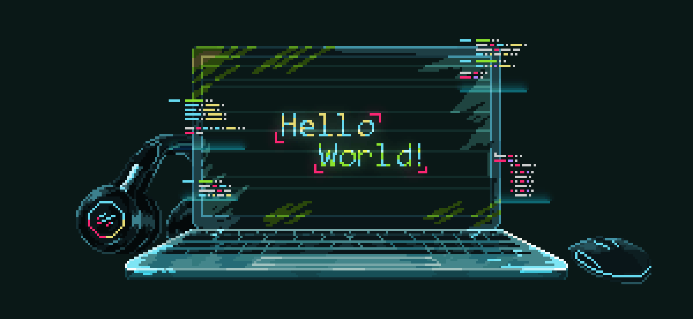

# Olá, me chamo João Guedes

Sou estudante do curso de :mortar_board: <strong>Tecnologia em Análise e Desenvolvimento de Sistemas</strong>, trabalho atualmente como <strong>Analista de Dados</strong>. A cada dia busco aprender mais, seja Back End ou Front End, sempre buscando me superar! Já possuo certo conhecimento em algumas liguagens como <code>c++</code>, <code>php</code>, <code>python</code>, <code>Java</code>,<code>JavaScript</code>, dentre outras... Sou casado e tenho uma :family: maravilhosa, almejo grandes metas e almejo um maior aperfeiçoamento como programador e profissioal!.

 
 

## Conhecimentos e Habilidades em
 

   
  
  
  
  
  
  
  
  
  
  
  

 
 

## Minhas Estatísticas
 

 
 
## Meus Trabalhos e/ou Projetos
 

### Front End
---
<ul>
  <li> :sunglasses: <a href='https://github.dev/guedes-jr/Portfolio'>Meu Portfólio</a></li>
  <li> :eight_pointed_black_star: <a href='https://github.com/guedes-jr/Portfolio-Ninja'>Portfólio Ninja</a></li>
  <li> :airplane: <a href='https://github.com/guedes-jr/Front_End-Travel'>Travel - Agência de Viagêns</a></li>
  <li> :scissors: <a href='https://github.com/guedes-jr/Origin-BeautySalon'>Origin - BeautySalon</a></li>
  <li> :scissors: <a href='https://github.com/guedes-jr/NLW-Copa'>NLW - Copa</a></li>
</ul>

### Frameworks
---
<ul>
  <li>  Vite: <a href='https://github.com/guedes-jr/ExplorerLab-RocketPay'>Rocket Pay</a>
</ul>

### Outros
---
<ul>
  <li> :books: <a href='https://github.com/guedes-jr/Markdown'>Markdown</a></li>
</ul>
